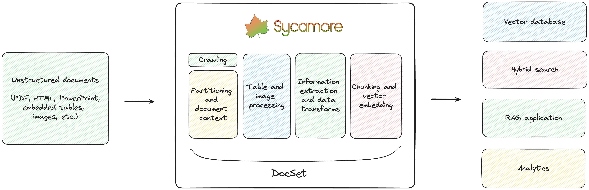

[](https://pypi.org/project/sycamore-ai/)
[](https://pypi.org/project/sycamore-ai/)
[](https://join.slack.com/t/sycamore-ulj8912/shared_invite/zt-23sv0yhgy-MywV5dkVQ~F98Aoejo48Jg)
[](https://sycamore.readthedocs.io/en/stable/?badge=stable)


Sycamore is an open source, AI-powered document processing engine for ETL, RAG, LLM-based applications, and analytics on unstructured data. Sycamore can partition and enrich a wide range of document types including reports, presentations, transcripts, manuals, and more. It can analyze and chunk complex documents such as PDFs and images with embedded tables, figures, graphs, and other infographics.

For processing PDFs, Sycamore leverages the [Aryn Partitioning Service](https://www.aryn.ai/post/announcing-the-aryn-partitioning-service), a serverless, GPU-powered API for segmenting and labeleing documents, doing OCR, extracting tables and images, and more. It levereages Aryn's state-of-the-art, [open source deep learning DETR AI model](https://huggingface.co/Aryn/deformable-detr-DocLayNet) trained on 80k+ enterprise documents, and it can lead to 6x more accurate data chunking and 2x improved recall on hybrid search or RAG when compared to alternate systems. You can [sign-up for free here](http://www.aryn.ai/get-started), or choose to run the Aryn Partitioner locally.

The Aryn Partitioning Service takes PDFs and returns the partitioned output in JSON, and you can use Sycamore for additional data extraction, enrichment, transforms, cleaning, and loading into downstream databases. You can choose the LLMs to use with these transforms.

Sycamore reliably loads your vector databases and hybrid search engines, including as OpenSearch, ElasticSearch, Pinecone, DuckDB and Weaviate, with higher quality data. 

The Sycamore framework is built around a scalable and robust abstraction for document processing called a DocSet, and includes powerful high-level transformations in Python for data processing, enrichment, and cleaning. DocSets also encapsulate scalable data processing techniques removing the undifferentiated heavy lifting of reliably loading chunks. DocSets' functional programming approach allows you to rapidly customize and experiment with your chunking for better quality RAG results.



## Features

- Integrated with the Aryn Partitioning Service, using a state-of-the art vision AI model for segmentation and preserving the semantic structure of documents
- DocSet abstraction to scalably and reliably transform and manipulate unstructured documents
- High-quality table extraction, OCR, visual summarization, LLM-powered UDFs, and other performant Python data transforms
- Quickly create vector embeddings using your choice of AI model
- Helpful features like automatic data crawlers (Amazon S3 and HTTP), Jupyter notebook for writing and iterating on jobs, and an OpenSearch hybrid search and RAG engine for testing
- Scalable [Ray](https://github.com/ray-project/ray) backend

## Demo

[Introduction to the Aryn Partitioning Service](https://www.aryn.ai/?name=ArynPartitioningService_Intro)

## Get Started

You can easily deploy Sycamore locally or on a virtual machine using Docker.

With Docker installed:

1.	Clone the Sycamore repo:

```git clone https://github.com/aryn-ai/sycamore```

2.	Set OpenAI Key:

```export OPENAI_API_KEY=YOUR-KEY```

3.	Go to:

```/sycamore```

4.	Launch Sycamore. Conatainers will be pulled from DockerHub:

```docker compose up --pull=always```

5.	The Sycamore demo query UI will be at localhost:3000

You can next choose to run a demo that [prepares and ingests data from the Sort Benchmark website](docs/source/welcome_to_sycamore/get_started.md#demo-ingest-and-query-sort-benchmark-dataset), [crawl data from a public website](docs/source/welcome_to_sycamore/get_started.md#demo-ingest-and-query-data-from-an-arbitrary-website), or write your own data preparation script.

For more info about Sycamore’s data ingestion and preparation feature set, visit the [Sycamore documentation](docs/source/data_ingestion_and_preparation/data_preparation_concepts.md).


## Resources

- Documentation: https://sycamore.readthedocs.io
- Slack: https://join.slack.com/t/sycamore-ulj8912/shared_invite/zt-23sv0yhgy-MywV5dkVQ~F98Aoejo48Jg
- Data preparation libraries (PyPi): https://pypi.org/project/sycamore-ai/
- Contact us: info@aryn.ai

## Contributing

Check out our [Contributing Guide](https://github.com/aryn-ai/sycamore/blob/main/CONTRIBUTING.md) for more information about how to contribute to Sycamore and set up your environment for development.
