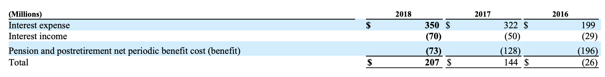
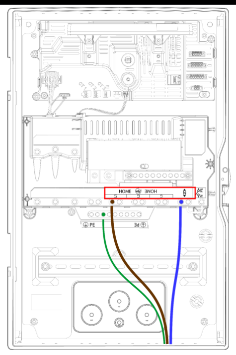

## An Introduction to the Aryn Partitioning Service 
You can use the Aryn Partitioning Service to easily chunk and extract data from complex documents. The Partitioning Service accepts PDF and Microsoft office formats (.docx, .doc, .pptx, .ppt). It can extract paragraphs, tables and images. It returns detailed information about the components it has just identified in a JSON object.  The following two sections will walk you through two examples where we segment PDF documents and extract a table and an image from those documents using the python aryn-sdk.

### Extracting Tables from a PDF

In [this example](https://colab.research.google.com/drive/1Qpd-llPC-EPzuTwLfnguMnrQk0eclyqJ?usp=sharing), we’ll use the Partitioning Service to extract the “Supplemental Income” table (shown below) from the 10k financial document  of 3M, and turn it into a pandas dataframe. 



We’ll go through the important code snippets below  to see what’s going on.  (Try it out in  [colab](https://colab.research.google.com/drive/1Qpd-llPC-EPzuTwLfnguMnrQk0eclyqJ?usp=sharing)  yourself! )


Let’s focus on the following code that makes a call to the Aryn Partitioning Service: 

```python
import aryn_sdk
from aryn_sdk.partition import partition_file, tables_to_pandas
import pandas as pd
from io import BytesIO

file = open('my-document.pdf', 'rb')
aryn_api_key = 'YOUR-KEY-HERE'

## Make a call to the Aryn Partitioning Service (APS) 
## param extract_table_structure (boolean): extract tables and their structural content. default: False
## param use_ocr (boolean): extract text using an OCR model instead of extracting embedded text in PDF. default: False
## returns: JSON object with elements representing information inside the PDF
partitioned_file = partition_file(file, aryn_api_key, extract_table_structure=True, use_ocr=True)
```

If you inspect the `partitioned_file` variable, you’ll notice that it’s a large JSON object with details about all the components in the PDF (checkout [this page](./aps_output.md) to understand the schema of the returned JSON object in detail).  Below, we highlight  the ‘table’ element that contains the information about the table in the page.

```
{'type': 'table',
   'bbox': [0.09080806058995863,
    0.11205035122958097,
    0.8889295869715074,
    0.17521638350053267],
   'properties': {'score': 0.9164711236953735,
    'title': None,
    'columns': None,
    'rows': None,
    'page_number': 1},
   'table': {'cells': [ {'content': '(Millions)',
      'rows': [0],
      'cols': [0],
      'is_header': True,
      'bbox': {'x1': 0.09080806058995863,
       'y1': 0.11341398759321733,
       'x2': 0.40610217823701744,
       'y2': 0.12250489668412642},
      'properties': {}},
     {'content': '2018',
      'rows': [0],
      'cols': [1],
      'is_header': True,
      'bbox': {'x1': 0.6113962958840763,
       'y1': 0.11341398759321733,
       'x2': 0.6766904135311351,
       'y2': 0.12250489668412642},
      'properties': {}},
     {'content': '2017',
      'rows': [0],
      'cols': [2],
      'is_header': True,
      'bbox': {'x1': 0.718455119413488,
       'y1': 0.11341398759321733,
       'x2': 0.7825727664723116,
       'y2': 0.12250489668412642},
      'properties': {}},
     
     ... 
     
     ]}}

```

In particular let's look at the “cells” field  which is an array of cell objects that represent each of the cells in the table. Let’s focus on the first element of that list. 

```
{'cells': [ {'content': '(Millions)',
      'rows': [0],
      'cols': [0],
      'is_header': True,
      'bbox': {'x1': 0.09080806058995863,
       'y1': 0.11341398759321733,
       'x2': 0.40610217823701744,
       'y2': 0.12250489668412642},
      'properties': {}} ... }

```

Here we've detected the first cell, its bounding box (which indicates the coordinates of the cell in the PDF), whether it’s a header cell and its contents. You can then process this JSON however you’d like for further analysis. In [the notebook](https://colab.research.google.com/drive/1Qpd-llPC-EPzuTwLfnguMnrQk0eclyqJ?usp=sharing)  we use the tables_to_pandas function to turn the JSON into a pandas dataframe and then perform some analysis on it:

```python
pandas = tables_to_pandas(partitioned_file)

tables = []
#pull out the tables from the list of elements
for elt, dataframe in pandas:
    if elt['type'] == 'table':
        tables.append(dataframe)
        
supplemental_income = tables[0]
display(supplemental_income)
```

| (Millions) | 2018 | 2017 | 2016 |
| --- | --- | --- | --- |
| Interest expense | 350 | 322 | 199 |
| Interest income | (70) | (50) | (29) |
| Pension and postretirement net periodic benefi... | (73) | (128) | (196) |
| Total | 207 | 144 | (26)  |


### Extracting Images from a PDF

In [this example](https://colab.research.google.com/drive/1n5zRm5hfHhxs7dA0FncC44VjlpiPJLWq?usp=sharing), we’ll use the Partitioning Service to extract an image from a battery manual.  We’ll go through the important code snippets below  to see what’s going on (Try it out in  [colab](https://colab.research.google.com/drive/1n5zRm5hfHhxs7dA0FncC44VjlpiPJLWq?usp=sharing)  yourself! )

Let’s focus on the following code that makes a call to the Aryn Partitioning Service: 

```python
import aryn_sdk
from aryn_sdk.partition import partition_file, tables_to_pandas
import pandas as pd
from io import BytesIO

file = open('my-document.pdf', 'rb')
aryn_api_key = 'YOUR-KEY-HERE'

## Make a call to the Aryn Partitioning Service (APS) 
## param use_ocr (boolean): extract text using an OCR model instead of extracting embedded text in PDF. default: False
## param extract_images (boolean):  extract image contents. default: False
## returns: JSON object with elements representing information inside the PDF
partitioned_file = partition_file(file, aryn_api_key, extract_images=True, use_ocr=True)
```

If you inspect the partitioned_file variable, you’ll notice that it’s a large JSON object with details about all the components in the PDF (checkout [this page](./aps_output.md) to understand the schema of the returned JSON object in detail).  Below, we highlight  the ‘Image’ element that contains the information about some of the images in the page: 

```
[
  {
    "type": "Section-header",
    "bbox": [
      0.06470742618336398,
      0.08396875554865056,
      0.3483343505859375,
      0.1039327656139027
    ],
    "properties": {
      "score": 0.7253036499023438,
      "page_number": 1
    },
    "text_representation": "Make AC Power Connections\n"
  },
  {
    "type": "Image",
    "bbox": [
      0.3593270694508272,
      0.10833765896883878,
      0.6269251924402574,
      0.42288088711825284
    ],
    "properties": {
      "score": 0.7996300458908081,
      "image_size": [
        475,
        712
      ],
      "image_mode": "RGB",
      "image_format": null,
      "page_number": 1
    },
    "text_representation": "",
    "binary_representation": "AAAAAA.."
    }, ...
]
```

In particular let's look at the element which highlights the Image that has been detected. 

```
{
    "type": "Image",
    "bbox": [
      0.3593270694508272,
      0.10833765896883878,
      0.6269251924402574,
      0.42288088711825284
    ],
    "properties": {
      "score": 0.7996300458908081,
      "image_size": [
        475,
        712
      ],
      "image_mode": "RGB",
      "image_format": null,
      "page_number": 1
    },
    "text_representation": "",
    "binary_representation": "AAAAAA.."
    }
```

This JSON object represents one of the images in the PDF. You’ll notice that the image’s binary representation, its bounding box (which indicates the coordinates of the image in the PDF), and certain other properties (image_mode, image_size etc.) are returned back. You can then process this JSON however you’d like for further analysis. In the notebook, we use the Pillow Image module from python to display the extracted image on its own. 

```python
## extract all the images from the JSON and print out the JSON representation of the first image
images = [e for e in partitioned_file['elements'] if e['type'] == 'Image']
first_image = images[0]

## read in the image and display it
image_width = first_image['properties']['image_size'][0]
image_height = first_image['properties']['image_size'][1]
image_mode = first_image['properties']['image_mode']
image = Image.frombytes(image_mode,  (image_width, image_height), base64.b64decode(first_image['binary_representation']))

#display the image
image 
```



### More examples


#### Using the Partitioning Service with Sycamore

You can  checkout a notebook [here](https://github.com/aryn-ai/sycamore/blob/main/notebooks/pinecone-writer.ipynb) to learn how to use the partitioning service with Aryn's Sycamore analytics engine. This notebook walks through an example where you can use Sycamore to transform your data and load it into a vector database.

#### Using the Partitioning Service with Langchain

You can  checkout a notebook [here](https://github.com/aryn-ai/sycamore/blob/main/notebooks/ArynPartitionerWithLangchain.ipynb) to learn how to use the partitioning service with Langchain.
