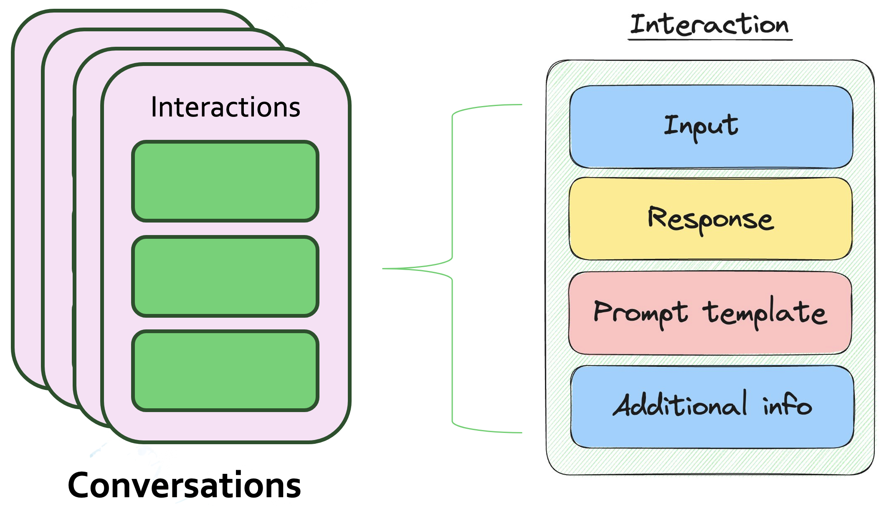

# Conversation memory concepts

## Overview

In conversational search, Sycamore can store the state of a user conversation to use with the next user interaction. Sycamore uses the [conversation memory feature set in OpenSearch](https://opensearch.org/docs/latest/search-plugins/conversational-search/#conversation-memory) (contributed by [Aryn](http://www.aryn.ai)) for this purpose, enabling you to easily create conversations and add interactions to those conversations. Sycamore automatically implements this when using conversations in the demo query UI.

You can also use Sycamore's conversion memory feature set directly as a scalable conversation storage for generative AI agenets and other applications. It also makes it easy to debug and tune your LLM applications by saving the prompt and response from the LLM. When prompt engineering, tuning, and debugging an LLM-based app, this is critical information - as the exact wording of a prompt can grealty effect the response.

## Architecture

Sycamore's conversation memory uses the ml-commons plugin in OpenSearch. It is a CRUD API built for storing conversations and adding new interactions. It uses a pair of OpenSearch system indices to store this data. We represent conversations as a list of interactions, where each interaction consists of an “input and a “response.” We also add two other fields to interactions and conversations to enable adding the prompt template used in the interaction and additional info specified by the application.





The structures are:

```javascript
structure ConversationMetadata {
    conversationId: ConversationId
    create_time: Timestamp
    name: String
}
```

```javascript
structure Interaction {
    conversation_id: ConversationId
    interaction_id: InteractionId
    input: String
    prompt_template: String
    response: String
    origin: String
    create_time: Timestamp
    additional_info: String
}
```

For details on the APIs please refer to the [API Spec](../APIs/conversation_memory/functions.md) or the official OpenSearch [documentation](https://opensearch.org/docs/latest/search-plugins/conversational-search/) on conversational search.
