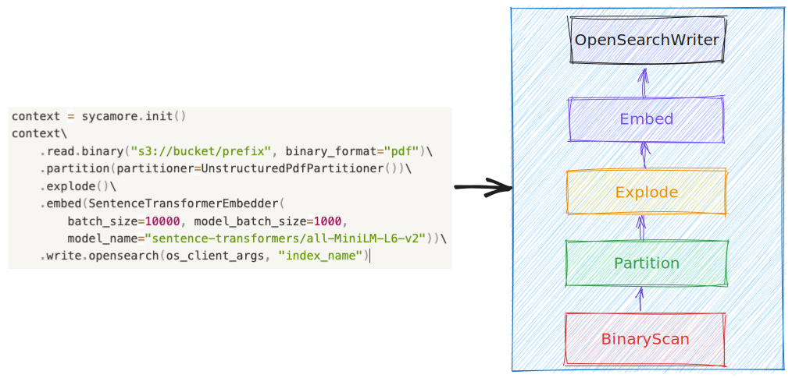

# Data Preparation Concepts

You can use the default data preparation code NEED LINK to segment, process, enrich, embed, and load your data into Sycamore. However, to get the best results on complex data, you will likely need to write custom code specific for your data to prepare it for search and analytics.

Sycamore provides a toolkit for data cleaning, information extraction, enrichment, summarization, and generation of vector embeddings that encapsulate the semantics of your data. It uses your choice of generative AI models to make these operations simple and effective, and it enables quick experimentation and iteration. You write your data preparation code in Python, and Sycamore uses Ray to easily scale as your workloads grow.

Sycamore data preparation code uses the concepts below, and available transforms are here. [LINK] Also, as an example, you can view the code for the default data preparation code here. [LINK] To learn more about how to run your custom code, click here. [LINK]

## Sycamore data preparation concepts

### DocSet

A DocSet, short for “documentation set,” is a distributed collection of documents bundled together for processing. Sycamore provides a variety of transformations on DocSets to help customers handle unstructured data easily. For example, the following code snippet shows several transforms chained together to process a collection of PDF documents.

```context = sycamore.init()
docset = context.read\
    .binary("s3://bucket/prefix", binary_format="pdf")\
    .partition(partitioner=UnstructuredPdfPartitioner())\
    .explode()\
    .embed(SentenceTransformerEmbedder(
        batch_size=10000, model_batch_size=1000,
        model_name="sentence-transformers/all-MiniLM-L6-v2"))
```


### Document

A Document is a generic representation of an unstructured document in a format like PDF, HTML. Though different types of document may have different properties, they all contain the following common fields:

* **doc_id:** A unique identifier for the document. Defaults to a uuid.

* **parent_id:** In Sycamore, certain operations create parent-child relationships between documents. For example, the explode transform promotes elements to be top-level documents, and these documents retain a pointer to the document from which they were created using the parent_id field. For those documents which have no parent, parent_id is None.

* **binary_representation, text_representation:** The raw content of the document in stored in the appropriate format. For example, the content of a PDF document will be stored as the binary_representation, while an HTML page will be stored as text_representation.

* **elements:** a list of elements belonging to this document. A document does not necessarily always have elements, for instance, before a document is chunked.

* **properties:** A collection of system or customer defined properties, for instance, a PDF document might have title and author properties.

### Element

It is often useful to process different parts of a document separately. For example, you might want to process tables differently than text paragraphs, and typically small chunks of text are embedded separately for vector search. In Sycamore, these chunks are called elements. Like documents, elements contain a text or binary representations and collection of properties that can be set by the user or by built-in transforms.

### Query Execution

In Sycamore, DocSet evaluation is lazy, which means that transforms on DocSet aren’t executed until needed by an operation like show or write. Internally, the transforms are converted to an execution plan in the backend. This lazy execution framework provides opportunities to sanitize and optimize the query execution. For instance, we could convert the above DocSet query into following execution plan.


