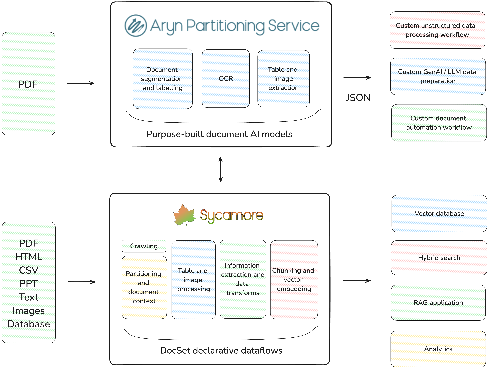

Welcome to Sycamore!
================
Sycamore is a document processing engine covered under the Apache v2.0 license. It's built for complex unstructured data, such as documents, presentations, transcripts, embedded tables, and internal knowledge repositories. Sycamore provides a declarative dataflow abstraction called a DocSet to make manipulating unstructured documents easy and scalable. It’s similar in style to Apache Spark and Pandas, but for collections of unstructured documents. DocSets can be used not only for extracting, enriching, summarizing, and cleaning unstructured data, but also for running powerful analytics on these datasets.

Sycamore uses LLM-powered transforms, and you can choose the model to leverage. It can handle complex documents with embedded tables, figures, graphs, and other infographics. For ETL use cases, Sycamore reliably generates vector embeddings with the model of your choice, and loads vector databases and search engines like Pinecone, OpenSearch, Weaviate, Elasticsearch, Qdrant and more.

For Aryn DocParse and Aryn DocPrep, please visit the `Aryn DocParse documentation <https://docs.aryn.ai>`_.

**Key Features**

* **Developer-focused reliable and flexible document processing engine with Sycamore.** Similar to Apache Spark, but for handling and processing unstructured document collections at scale. Easily process document collections using sophisticated data transforms and LLMs, while maintaining overall document lineage using Sycamore’s DocSet abstraction. Create better chunks and extract higher quality metadata, leading to 30% better recall and 2x better accuracy on real-world use cases.

* **Scalable, fault-tolerant, and reliable loading of vector DBs and search indexes.** Generate vector embeddings using your choice of model, easily build knowledge graphs, and other output formats from your unstructured data. Targets include leading engines like Elasticsearch, OpenSearch, Weaviate, Pinecone, DuckDB, Qdrant and more. Aryn can seamlessly handle millions of documents.

* **Plug-and-Play LLMs.** Use different LLMs for entity extraction, vector embedding, and post-processing steps.

Getting Started
--------------------

Sycamore
^^^^^^^^

1. Install Sycamore with ``pip``:

.. code-block:: python

    pip install sycamore-ai

..

Support for vector databases can be installed using extras. For example,

.. code-block:: python

    pip install sycamore-ai[opensearch]

..

will install Sycamore with OpenSearch support. You can find a list of supported connectors :doc:`here </sycamore/connectors>`.

By default, Sycamore works with Aryn DocParse to process documents. You can `sign-up here for free <https://www.aryn.ai/get-started>`_ to get an API Key. To install support for local partitioning and embedding models, you can install Sycamore with the ``local-inference`` extra:

.. code-block:: python

    pip install sycamore-ai[local-inference]

..

2. You can now create and run Sycamore scripts to process your documents and unstructured data. `This notebook <https://github.com/aryn-ai/sycamore/blob/main/notebooks/metadata-extraction.ipynb>`_ demonstrates a variety of Sycamore data transforms and loads an OpenSearch hybrid search index.

More Resources
--------------------
- Visit Aryn DocParse and DocPrep Documentation: https://docs.aryn.ai/introduction
- Join the Aryn / Sycamore Slack workspace: https://join.slack.com/t/sycamore-ulj8912/shared_invite/zt-23sv0yhgy-MywV5dkVQ~F98Aoejo48Jg
- Watch the intro video to Aryn DocParse (formerly known as the Aryn Partitioning Service): https://www.aryn.ai/?name=ArynPartitioningService_Intro
- Watch the intro video to Aryn DocPrep: https://www.youtube.com/watch?v=OMjLQ_0bSgU
- Sign up for Aryn DocParse: https://aryn.ai/get-started
- Use the Aryn Playground to experiment with DocParse: https://play.aryn.cloud/partitioning
- View the Sycamore GitHub: https://github.com/aryn-ai/sycamore

.. toctree::
   :maxdepth: 2
   :hidden:

   /sycamore/get_started.rst
   /sycamore/using_jupyter.md
   /sycamore/transforms.rst
   /sycamore/connectors.rst
   /sycamore/query.rst
   /sycamore/tutorials.rst
   /sycamore/APIs.rst
   /sycamore/SDK_APIs.rst
