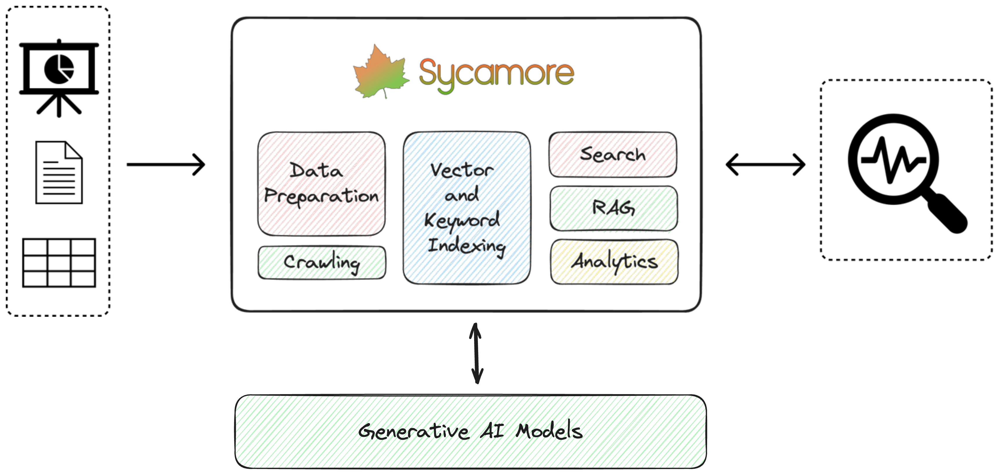

====================================

Welcome to Sycamore!
--------------------

Sycamore is an open-source conversational search and analytics platform for complex unstructured data, such as documents, presentations, transcripts, embedded tables, and internal knowledge repositories. It retrieves and synthesizes high-quality answers through bringing AI to data preparation, indexing, and retrieval. Sycamore makes it easy to prepare unstructured data for search and analytics, providing a toolkit for data cleaning, information extraction, enrichment, summarization, and generation of vector embeddings that encapsulate the semantics of data. Sycamore uses your choice of generative AI models to make these operations simple and effective, and it enables quick experimentation and iteration. Additionally, Sycamore uses OpenSearch for storage and queries of vector embeddings and associated data.

**Key Features**

* **Answer Hard Questions on Complex Data.** Prepares and enriches complex unstructured data for search and analytics through advanced data segmentation, LLM-powered UDFs for data enrichment, performant data manipulation with Python, and vector embeddings using a variety of AI models.

* **Multiple Query Options.** Flexible query operations over unstructured data including RAG, hybrid search, analytical functions, natural language/conversational search, and custom post-processing functions.

* **Secure and Scalable.** Sycamore leverages OpenSearch, an open-source enterprise-scale search and analytics engine for indexing, enabling hybrid (vector + keyword) search, analytical functions, conversational memory, and more. Also, it offers features like fine-grained access control. OpenSearch is used by thousands of enterprise customers for mission-critical workloads.

* **Develop Quickly.** Helpful features like automatic data crawlers (Amazon S3 and HTTP) and Jupyter notebook support to create, iterate, and test custom data preparation code.

* **Plug-and-Play LLMs.** Use different LLMs for entity extraction, vector embedding, RAG, and post-processing steps. Currently supporting OpenAI and Amazon Bedrock, and more to come!

Getting Started
--------------------

You can easily deploy Sycamore locally or on a virtual machine using Docker.

With Docker installed:

1.	Clone the Sycamore repo: 

``git clone https://github.com/aryn-ai/sycamore``

2.	Set OpenAI Key:

``export OPENAI_API_KEY=YOUR-KEY``

3.	Go to: 

``/sycamore``

4.	Launch Sycamore. Conatainers will be pulled from DockerHub:

``Docker compose up --pull=always``

5.	The Sycamore demo query UI will be at localhost:3000

You can next choose to run a demo that `prepares and ingests data from the Sort Benchmark website<docs/source/welcome_to_sycamore/get_started.md#demo-ingest-and-query-sort-benchmark-dataset>`_, [crawl data from a public website](docs/source/welcome_to_sycamore/get_started.md#demo-ingest-and-query-data-from-an-arbitrary-website), or write your own data preparation script.

For more info about Sycamore’s data ingestion and preparation feature set, visit the [Sycamore documentation](docs/source/data_ingestion_and_preparation/data_preparation_concepts.md).

Run a demo
--------------------

a. Load demo dataset using the HTTP crawler (visit tutorial)[docs/source/welcome_to_sycamore/get_started.md#demo-ingest-and-query-sort-benchmark-dataset]:

``docker compose run crawl_sort_benchmark``

b. Load website data via HTTP crawler (visit tutorial)[docs/source/welcome_to_sycamore/get_started.md#demo-ingest-and-query-data-from-an-arbitrary-website]:

``docker compose run crawl_http http://my.website.example.com``

c. Write custom data ingestion and preparation code using the Jupyter container. Access it via the URL from:

``docker compose logs jupyter | grep Visit``

Once you've loaded data, you can run conversational search on your data with the Sycamore demo UI at localhost:3000

For more details about getting started, visit the (Sycamore Getting Started page)[docs/source/welcome_to_sycamore/get_started.md].

More Resources
--------------------
- Join the Sycamore Slack workspace: https://join.slack.com/t/sycamore-ulj8912/shared_invite/zt-23sv0yhgy-MywV5dkVQ~F98Aoejo48Jg
- View the Sycamore GitHub: https://github.com/aryn-ai/sycamore
- To learn more about Sycamore’s architecture: NEED LINK
- For more info about data preparation in Sycamore: NEED LINK
- To integrate your own query front-end to Sycamore, visit here  NEED LINK

.. toctree::
   :caption: Key Concepts
   :maxdepth: 2
   :hidden:

   ../key_concepts/concepts.md
   ../key_concepts/transforms.rst

.. toctree::
   :maxdepth: 1
   :caption: Tutorials
   :hidden:

   ../tutorials/end_to_end_tutorials.md

.. toctree::
   :caption: APIS
   :maxdepth: 2
   :hidden:

   ../APIs/index.rst
