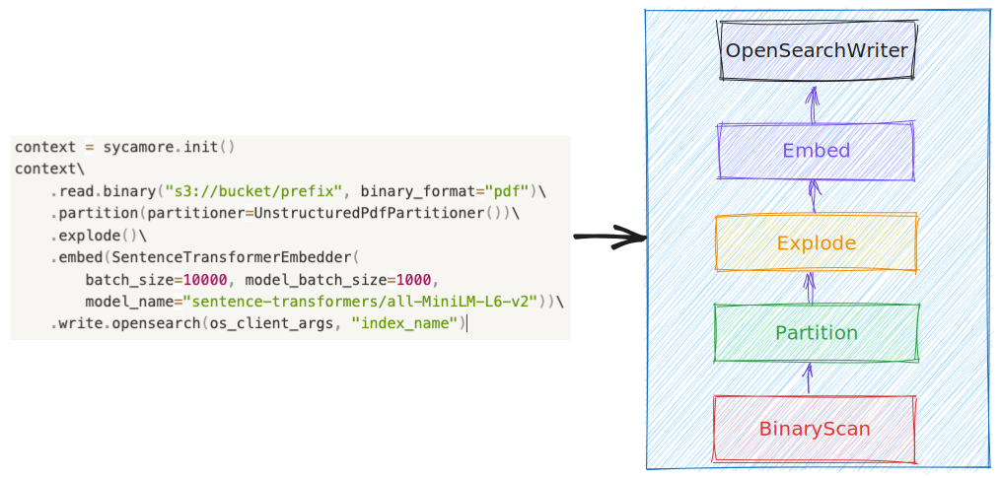

# Concepts

## DocSet

A DocSet, short for "documentation set," is a distributed collection of documents bundled together for processing. Sycamore provides transformations on DocSet like partition, embedding, explode to help customers handle unstructured data easily.

```python
context = sycamore.init()
docset = context.read\
    .binary("s3://bucket/prefix", binary_format="pdf")\
    .partition(partitioner=UnstructuredPdfPartitioner())\
    .explode()\
    .embed(SentenceTransformerEmbedder(
        batch_size=10000, model_batch_size=1000,
        model_name="sentence-transformers/all-MiniLM-L6-v2"))
```

## Document:

A document is a generic structural representation over unstructured data like PDF, HTML. Though different types of document may have different schema, basically all document contains following common fields:

- **doc_id** : short for document id, it uniquely identifies a document

- **parent_id** : in sycamore, documents might maintain relationship between each other, for instance, if we promote elements of a document into document using transformation explode, these newly promoted documents would be the children of the original parent document. We keep this parent-child relationship by adding a parent_id field in each child document. For those documents which have no parent, parent_id is None.

- **binary_representation** : the raw content of this document in binary format if possible.

- **properties** : a bag of system or customer defined properties, for instance, a PDF document might have title, authors as its property.

- **elements** : a list of elements belonging to this document. A document does not necessarily always have elements, for instance, before a document is chunked.

## Element

In sycamore, a document could be chunked into smaller pieces for further processing like embedding, reordering etc. We call each of these small chunk elements. Similarly to document, each element might have following common fields:

binary_representation: the raw content of this element in binary format if possible.

text_representation: text representation of this element if possible.

properties: a bag of system or customer defined properties, e.g. page number of the element in current document

## Query Execution

In sycamore, DocSet execution is lazy, this means that transformations on DocSet aren’t executed until we call an action operation like limit, show or write. Internally, the transformations are converted to an execution plan in the backend. This lazy execution framework provides opportunities to sanitize and optimize the query execution. For instance, we could convert the above DocSet query into following execution plan.


