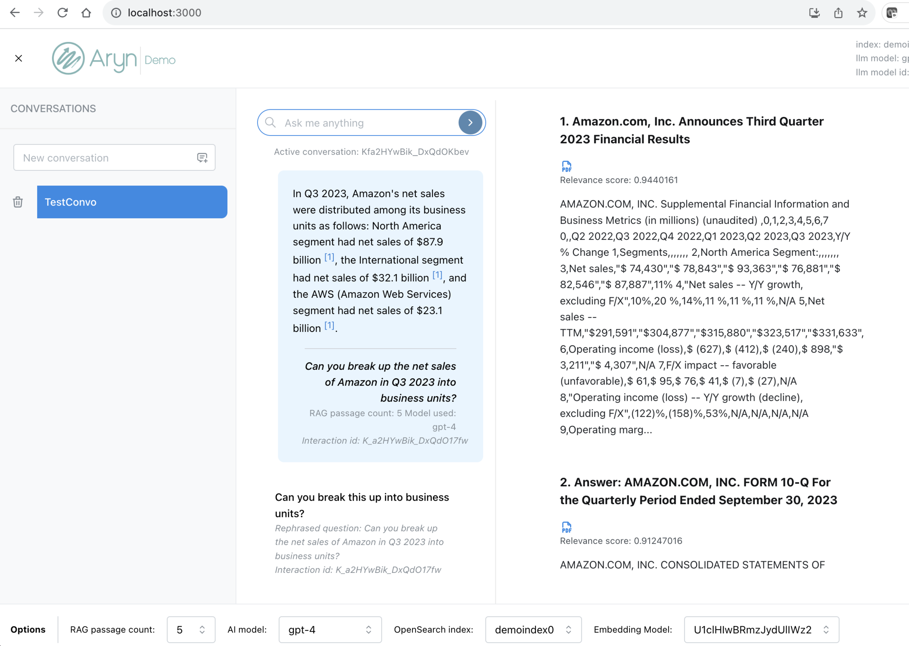

## Using the Demo Query UI

Sycamore includes a simple UI to submit queries and display retreival-augmented generation (RAG) answers and hybrid search results. The UI is deployed in the conatiner `sycamore-demo-ui` and is accessed at `localhost:3000`. It is an easy way to test the answer quality from your Sycamore stack, and how iterating with your data preparation and enrichment affects the overal quality.

You can create a new conversation by entering the name in the text box in the "Conversations" panel and hit enter. Then, you can submit questions in the middle panel.

Screenshot answering questions on financial data:

