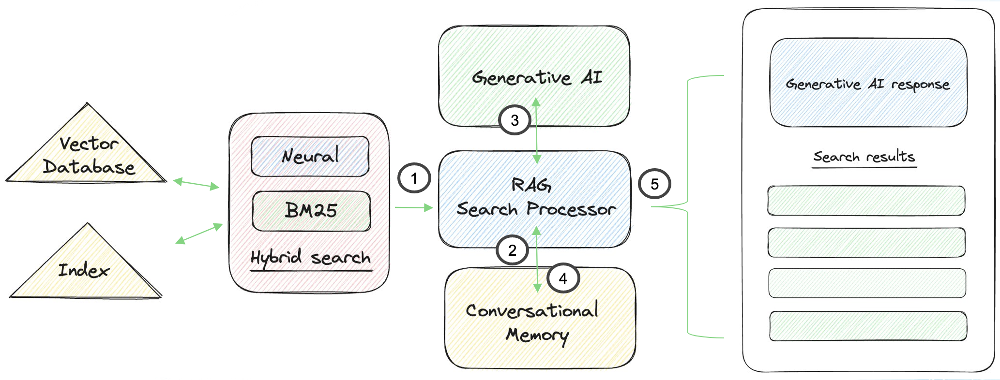

# Using Retrieval-Augmented Generation (RAG) pipelines

## Overview
[Retrieval-augmented generation (RAG)](https://arxiv.org/abs/2005.11401) is a popular method to generate natural language answers to questions using LLMs and indexed data. It retreives relevant data to a query, and then sends it along with a prompt to a LLM to sythensize an answer. Sycamore implements RAG using an [OpenSearch Search Pipeline](https://opensearch.org/docs/latest/search-plugins/conversational-search/#rag-pipeline) to orchestrate interactions with LLMs. 



The diagram above showes the flow of the RAG Search Processor.

1. The results from a hybrid search query are retrieved as the search context
2. The previous interactions from conversational memory are retrieved as conversation context
3. The processor constructs a prompt for an LLM using the search context, conversational context, and prompt template. It sends this to the LLM and gets a response
4. The response is added to the question and additional metadata, and saved in conversational memory as an interaction
5. The generative response and list of hybrid search results are returned to the application

If a conversation ID wasn't supplied (see [here](../conversational_memory/using_with_conversational_search.md)), then the processor will not retrieve the conversational context or add an interactoin to conversational memory.

## Using the RAG pipeline

Sycamore has a default RAG pipeline named `hybrid_rag_pipeline`, and it uses OpenAI GPT-3.5-TURBO as the LLM by default. To use the pipeline, specify it in your request and add the 'generative_qa_parameters':

```javascript
GET <index_name>/_search?search_pipeline=hybrid_rag_pipeline
{
  "query": {
    "hybrid": {
      "queries": [
        {
          "match": {
            "text_representation": "Who wrote the book of love"
          }
        },
        {
          "neural": {
            "embedding": {
              "query_text": "Who wrote the book of love",
              "model_id": "<embedding model id>",
              "k": 100
            }
          }
        }
      ]
    }
  },
  "ext": {
    "generative_qa_parameters": {
    "llm_question": "Who wrote the book of love?"
    }
  }
}
```

The resulting generative answer from the RAG pipeline is in `response.ext`.

You can choose a different OpenAI LLM to use by adding the parameter `llm-model` to override the default setting. An example changing this to GPT-4 is:


```javascript
GET <index_name>/_search?search_pipeline=hybrid_rag_pipeline
{
  "query": {
    "hybrid": {
      "queries": [
        {
          "match": {
            "text_representation": "Who wrote the book of love"
          }
        },
        {
          "neural": {
            "embedding": {
              "query_text": "Who wrote the book of love",
              "model_id": "<embedding model id>",
              "k": 100
            }
          }
        }
      ]
    }
  },
  "ext": {
    "generative_qa_parameters": {
      "llm_question": "Who wrote the book of love?",
      "llm_model": "gpt-4"
    }
  }
}
```

## Customize the RAG pipeline
To create a RAG pipeline, you must first have a [remote LLM-wrapper deployed with ml-commons](https://opensearch.org/docs/latest/ml-commons-plugin/remote-models/index/). Then, for example, to create a RAG pipeline called `rag_pipeline` using OpenAI GPT-4:

```javascript
PUT /_search/pipeline/my_rag_pipeline
{
  "description": "Retrieval Augmented Generation Pipeline",
  "response_processors": [
    {
      "retrieval_augmented_generation": {
        "tag": "openai_pipeline_demo",
        "model_id": "<remote_model_id>",
        "context_field_list": [
          "text_representation"
        ],
        "llm_model": "gpt-4"
      }
    }
  ]
}
```

To use this processor, simply add this to your OpenSearch query:

```javascript
GET <index_name>/_search?search_pipeline=my_rag_pipeline
{
  "query": {
    "hybrid": {
      "queries": [
        {
          "match": {
            "text_representation": "Who wrote the book of love"
          }
        },
        {
          "neural": {
            "embedding": {
              "query_text": "Who wrote the book of love",
              "model_id": "<embedding model id>",
              "k": 100
            }
          }
        }
      ]
    }
  },
  "ext": {
    "generative_qa_parameters": {
      "llm_question": "Who wrote the book of love?"
    }
  }
}
```

For more information, visit the [OpenSearch documentation](https://opensearch.org/docs/latest/search-plugins/conversational-search/#rag-pipeline).
