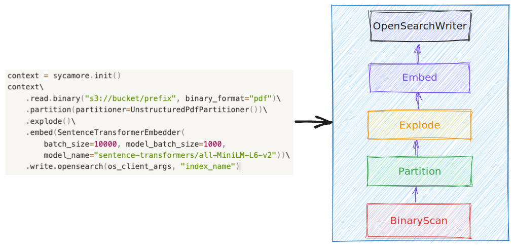

# Sycamore Concepts

Sycamore is a document processing engine built for ETL on unstructured data and loading vector databases and search indexes. It can enrich, transform, clean, and load data. Many of Sycamore's transforms utilize LLMs for information extraction, summarization, and data manipulation. You can configure the library to use the LLM of your choice, and also choose your AI model for creating vector embeddings.

You write your Sycamore code in Python, and the available transforms are [here](/transforms.rst). Sycamore runs on a [Ray](https://github.com/ray-project/ray) backend, which can scale as your workloads grow.


As an example, you can view the code for a sample Sycamore ETL job [in this notebook](https://github.com/aryn-ai/sycamore/blob/main/notebooks/default-prep-script.ipynb).


## Data structures

A DocSet, short for “Document Set,” is the central data abstraction for Sycamore. It's a distributed collection of documents bundled together for processing, and simplifies creating ETL pipelines on unstructured data. A DocSet contains Documents and Elements.


### DocSets

A DocSet contains a collection of documents of a single type, like PDF or HTML. Sycamore provides a variety of transformations on DocSets to help customers handle unstructured data easily. For example, the following code snippet shows several transforms chained together to process a collection of PDF documents and create vector embeddings:

```
context = sycamore.init()
docset = context.read\
    .binary("s3://bucket/prefix", binary_format="pdf")\
    .partition(partitioner=ArynPartitioner())\
    .explode()\
    .embed(SentenceTransformerEmbedder(
        batch_size=10000, model_batch_size=1000,
        model_name="sentence-transformers/all-MiniLM-L6-v2"))
```


### Documents

A Document is a generic representation of an unstructured document in a format like PDF or HTML. DocSets are comprised of Documents. Though different types of Documents may have different properties, they all contain [the following common fields](https://sycamore.readthedocs.io/en/stable/APIs/data/data.html#sycamore.data.document.Document):

* **binary_representation:** The raw content of the document. May not be present in elements after partitioning of non-binary inputs such as HTML.

* **doc_id:** A unique identifier for the Document. Defaults to a UUID.

* **elements:** A list of elements belonging to this Document. If the document has no elements, for example before it is chunked, this field will be ```[]```.

* **embedding:** The embedding associated with the document (usually after it is partitioned) or None if it hasn't been set.

* **parent_id:** In Sycamore, certain operations create parent-child relationships between Documents. For example, the ```explode``` transform promotes elements to be top-level Documents, and these Documents retain a pointer to the Document from which they were created using the parent_id field. For those Documents which have no parent, parent_id is ```None```.

* **properties:** A dictionary of system or customer defined properties. By default a Document will have ```path``` and ```location``` attributes. Additional information extration or processing in a Sycamore script can add extra, arbitrary attributes such as ```title```, ```author```, or other relevant metadata.

* **text_representation:** The extracted text from the Document; this representation is created in the elements after a .partition() step and promoted to top level Documents after an ```.explode()``` transform.

* **type:** The type of the Document (e.g. PDF or HTML)

Documents may have additional fields. See [the code](https://github.com/aryn-ai/sycamore/blob/main/lib/sycamore/sycamore/data/document.py#L8) or [the auto-generated documentation](https://sycamore.readthedocs.io/en/stable/APIs/data_preparation/document.html) for an exhaustive list.


### Elements

It is often useful to process different parts of a Document separately. For example, you might want to process tables differently than text paragraphs, and you might want to merge parts of a document together to create optimal chunks for vector embeddings.

In Sycamore, these chunks of Documents are called Elements, and an Element has a parent Document. Like Documents, Elements contain text or binary representations and collection of properties that can be populated by Sycamore transforms and processing. 

## Target and Source Connectors

You can write a DocSet out to vector databases, search engines, and files. This is a common last step in a Sycamore ETL job, where you write a DocSet with vector embeddings to a vector index. Information about available writers is [here](/connectors.rst)

You can also read data from these target sources into DocSets. This could be useful for reprocessing data in these databases or evaluating data quality in your indexes with Sycamore.


## Lazy Execution

In Sycamore, DocSet evaluation is lazy, which means that transforms on DocSets aren’t executed until needed by an operation like ```show()``` or ```write()```. This lazy execution framework provides opportunities to sanitize and optimize the execution plan before it runs. For instance, we could convert the above example DocSet transformations into the following execution plan:


