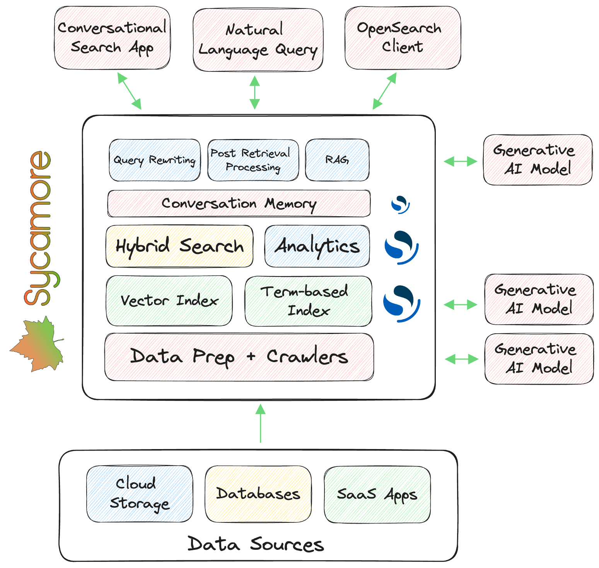

# Sycamore Architecture
Sycamore provides a one-stop shop for search and analytics on complex unstructured data, and has several high-level components. You can also view an [architecture diagram below.](#Architecture-Diagram)

## Data Ingestion and Preparation

* **Crawlers:** These containers take data from a specified location (e.g. Amazon S3 bucket or website) and store it in files that can be processed by the Importer. The crawlers will only download updated or new data.

* **Importer:** This container runs data preparation workloads with operations such as data cleaning, information extraction, enrichment, summarization, and the generation of vector embeddings that encapsulate the semantics of data. It will then load prepared data into Sycamore’s vector and keyword indexes. Sycamore enables Generative AI User Defined Functions (UDFs) with a variety of LLMs and can use various vector embedding models. It runs on Ray, an open-source framework for scaling Python workloads. The importer is responsible for error handling to minimize OOMs and avoid files that fail to import with a particular Sycamore script.

## Data Storage and Retrieval

Sycamore is built with OpenSearch, an open-source enterprise-scale search and analytics engine. It uses OpenSearch’s vector database and term-based index, hybrid (vector + keyword) search, analytical functions, and conversational memory.

* **Indexes:** Sycamore stores data in both vector and keyword-based indexes.

* **Hybrid Search (Query Execution):** This runs a vector and keyword search using the respective indexes, and then returns a single set of search results with the proper weighting from each. This leverages OpenSearch’s Neural Search, which utilizes FAISS.

* **Analytics Functions (Query Execution):** OpenSearch has a variety of analytics functions, such as group by or aggregation, that can be used in queries.

* **Conversational Memory:** This is used to store each interaction in a conversation and is stored in an OpenSearch index. Applications like conversational search can utilize this as the context in a series of interactions (conversation).

## Query Layer and Post-Processing

Sycamore uses LLMs to rewrite natural language queries and implement RAG. You can also query Sycamore directly with an OpenSearch client.

* **Query Rewriting:** Currently, this functionality is only available when submitting queries through the “Demo UI” container. Sycamore will use a generative AI model to rewrite queries based on conversation history and other heuristics.

* **Retrieval-Augmented Generation (RAG):** Sycamore can execute queries using a RAG pipeline in combination with a specified LLM. It can be used directly with an OpenSearch client (using the RAG Search Pipeline) or through the Demo UI.

* **Post Retrieval Processing:** Sycamore runs post-processing steps. For instance, it includes a customizable reranker to provide reranking heuristics after hybrid search returns initial results.

## Architecture Diagram

